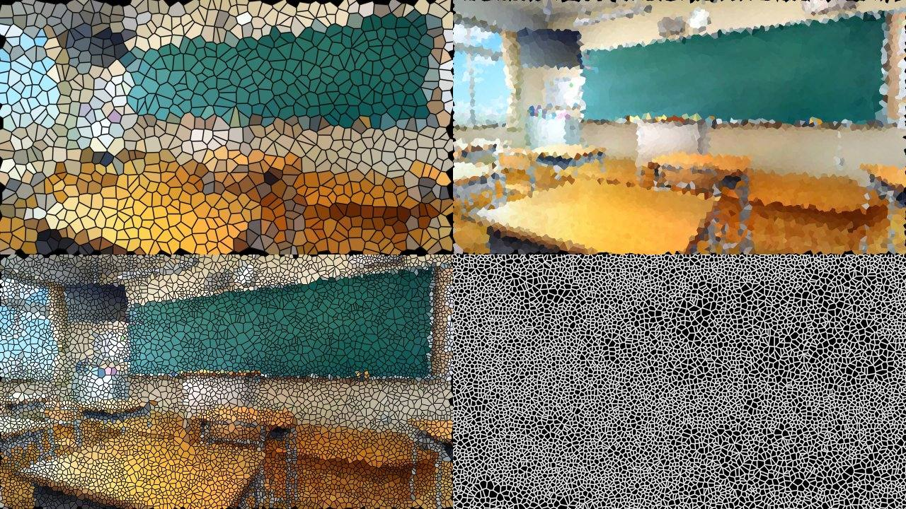

# Sa_voronizeymm



After Effects 用プラグイン [Sa_voronize](https://github.com/sabiasagimp4-ai/Sa_voronize) の YMM4 版です。画像をボロノイ図（不規則な多角形セル）のモザイクに変換します。セルの密集具合を画像の明るさ・色・輪郭から自動で決められます。

上の画像は、シェーダーの計算を CPU で再現した出力です（左上から 均一＋輪郭、輝度、エッジ検出、境界表示）。

## パラメーター

### グリッド

| 名前 | 既定値 | 内容 |
| --- | --- | --- |
| セルサイズ | 24px | セルのおおよその大きさ。1〜500px |
| 幅と高さを別指定 | オフ | オンにするとセル幅とセル高で縦横を別々に指定します |
| セル幅 / セル高 | 24px | 幅と高さを別指定がオンのときだけ表示されます |
| 不規則さ | 100% | 種を格子からずらす量。0%で規則正しい格子になります |
| 乱数シード | 1 | 模様を切り替えます。同じ値なら同じ模様です |
| サンプル方法 | 中心 | セルの色を種の1点から取るか、周りの近似平均から取るか |

### 密度

| 名前 | 既定値 | 内容 |
| --- | --- | --- |
| 密度の基準 | 均一 | 輝度・彩度・色相・エッジ検出を選ぶと、その値が高い所にセルが集まります |
| マップを反転 | オフ | 密度マップの明暗を反転します |
| マップを自動補正 | オン | 密度マップを画面内の最小〜最大に引き伸ばします |
| マップ黒点 / 白点 | 0% / 100% | 密度マップのレベル補正 |
| マップガンマ | 1.00 | 中間調の寄り方 |
| 密度の強さ | 100% | 0%で均一と同じ配置になります |
| 最小密度 | 10% | 密度が最も低い部分に残すセルの量 |
| エッジ検出の強さ | 10.0 | 密度の基準がエッジ検出のときの感度 |

密度の設定は、密度の基準が「均一」のときは効きません。

### 輪郭

| 名前 | 既定値 | 内容 |
| --- | --- | --- |
| 輪郭を表示 | オン | セルの境界線を描きます |
| 輪郭の太さ | 0px | **既定は0なので、適用直後は線が見えません** |
| 輪郭の色 | 黒 | 境界線の色 |
| 輪郭の不透明度 | 100% | 境界線の不透明度 |
| 硬い境界（アルファ０／１） | オフ | 線の内側のぼかしをやめ、べた塗りの線にします |

### 出力

| 名前 | 既定値 | 内容 |
| --- | --- | --- |
| 出力方法 | 画像 | 境界・距離・シードは確認用の表示です |
| 量 | 100% | 元の映像との合成量 |
| セルの角を滑らかに | 50% | セルの継ぎ目のギザギザを均す強さ。0%でオフ |
| 元画像の範囲で切り抜く | オフ | 元の画像の外にはみ出したセルを切り落とします |

## AE版との違い

- **参照レイヤー**と**マップヒストグラム**はありません。YMM4 の映像エフェクトは別のアイテムを入力にできないためです。
- **セルの角を滑らかに**は、AE版の画面全体の後処理（loilo-inc/smooth の移植）ではなく、セルの境界からの距離で隣のセルの色を混ぜるアンチエイリアスです。50%でおよそ1px幅になります。
- **マップを自動補正**は YMM4 版で追加した項目です。AE版は「幅と高さを別指定」がオフのときだけ自動で引き伸ばします。オフにすると値をそのまま使うので、動画でセル配置が揺れにくくなります。
- セルの格子はアイテムの中心を原点にします。
- 元画像の外に広げる幅は、セル（密度モードでは解析ブロック）の1.5倍です。

## インストール

[Releaseページ](https://github.com/sabiasagimp4-ai/Sa_voronizeymm/releases) から `.ymme` ファイルをダウンロードし、YMM4で開いてください。

リリース前のビルドは、Actions の各実行の Artifacts（`Sa_voronize`）からも取得できます。

## ビルド

Windows SDK の `fxc.exe` と YMM4 のフォルダーを指定します。

```powershell
dotnet build .\SaVoronize.csproj -c Release -p:YMM4DirPath=C:/YMM4/ -p:FxcPath="C:\Program Files (x86)\Windows Kits\10\bin\10.0.22621.0\x64\fxc.exe"
```

## テスト

シェーダーの共通部（`Shaders/*.hlsli`）を C++ としてコンパイルし、AE版の計算（`tests/reference/`）と画素単位で比べます。

```bash
bash tests/run_tests.sh
```
